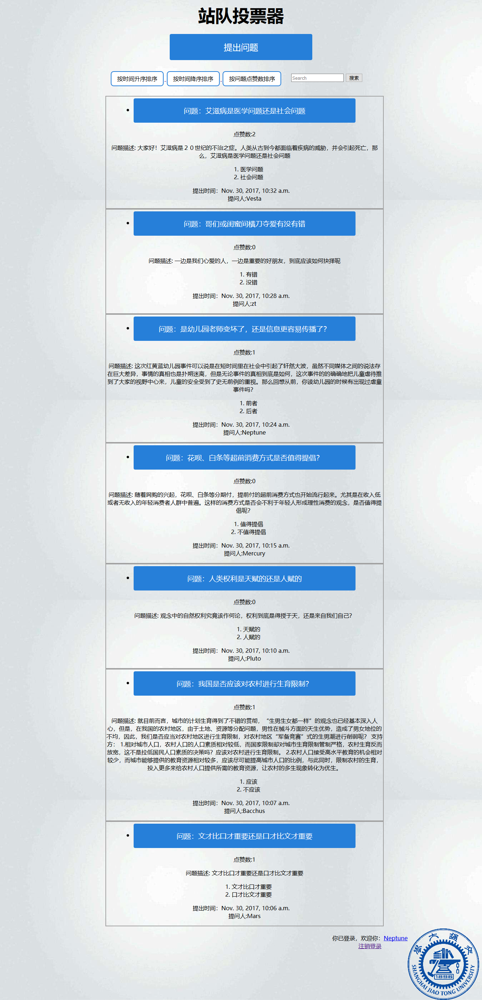
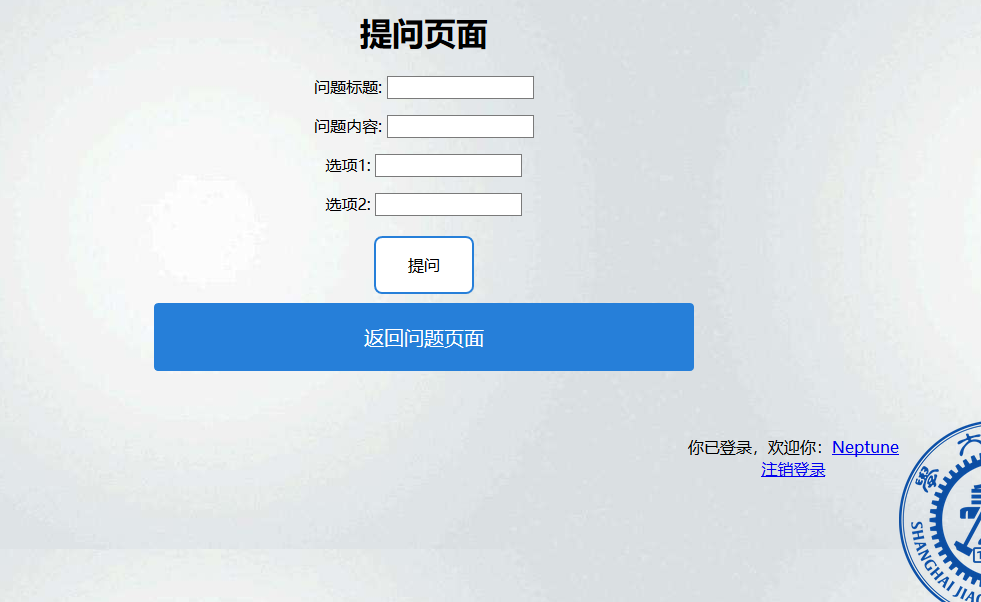
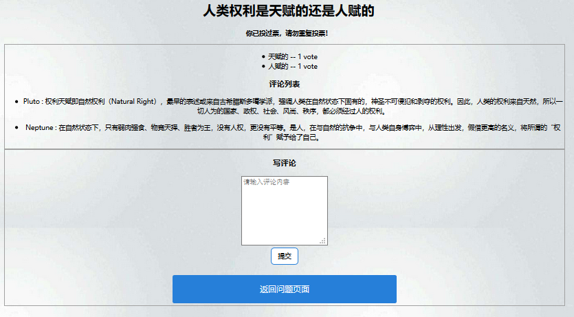

# Taking-Sides
***
#项目简介
开发环境：  
　　Python 2.7.9  
　　django  1.11.6  
　　需要安装的包：  
　　`pip install django-contrib-comments`
***
#如何使用 
* 在cmd命令行运行（以下路径仅是例子）。  
`C:\Users\lenovo\Desktop\Taking-Sides>python manage.py runserver` 
* 浏览器访问  `http://127.0.0.1:8000/`进入注册登录页面  。
* 完成登录之后，即可浏览辩题、提出辩题、参与投票和辩论以及对辩题点赞，每个人只能对一个问题投票一次。支持按照时间降序或升序排序，也可按点赞数来排序。
* 如果没有连接互联网，部分视图无法显示。
  
登录页面  
  
主页面  
  
提问页面  
  
评论页面
***
#感谢  
* 马颖华老师及助教苏宇老师
* 我们全组七人的团结协作

